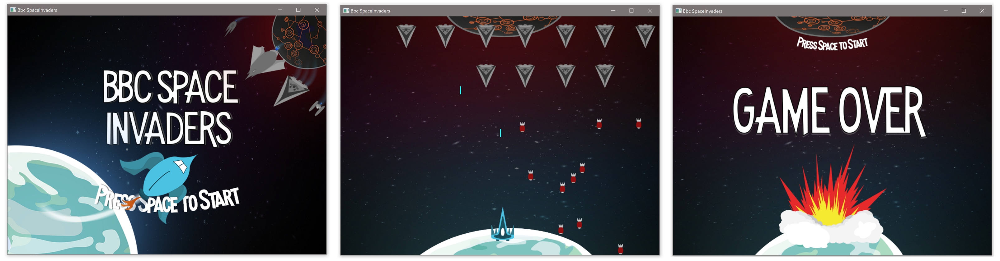
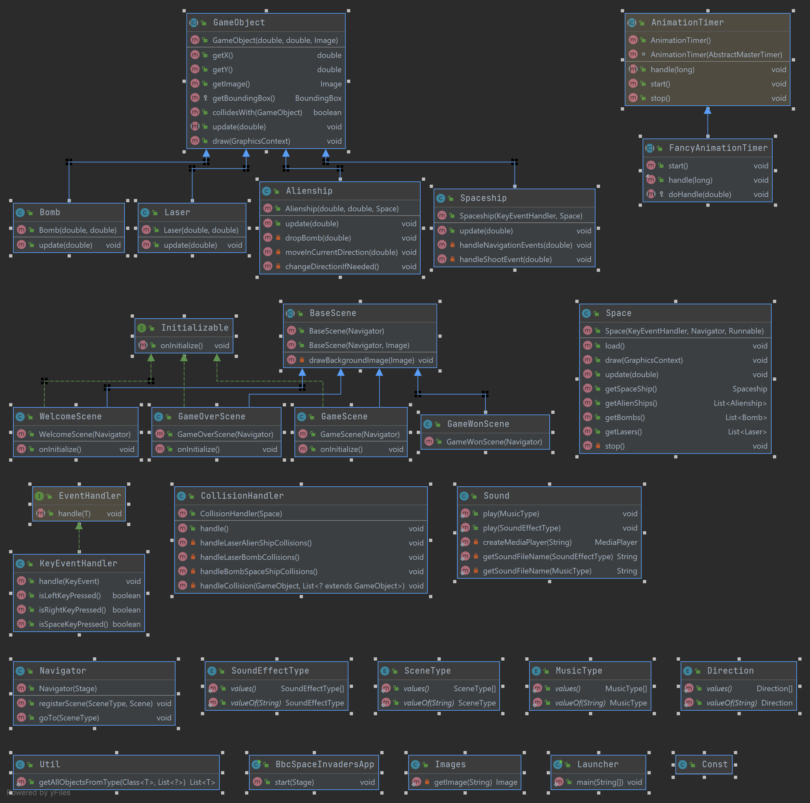

# Bbc SpaceInvaders
Dies ist die Musterinplementierung des offiziellen Bbc SpaceInvader Tutorials.
Der Code zeigt die Verwendung der wichtigsten OOP Konzepte (Kapselung / Vererbung / Polymorphismus) und bietet eine Grundlage für viele andere Arcade-Games.



## Spezial Features
- Musik und Soundeffekte

## Verwendete Frameworks
- Java SDK 21
- [JavaFX][fx] als Desktop UI-Framework
- Gradle als Build Tool

### Achitektur

Der JavaFX UI Code wurde zu grossen Teilen vom Gamecode entkoppelt.

### TODO's
Der Business Code im Order Game sollte keine Abhängigkeiten zu Java FX Packages enthalten.

### Installation
Der Code wurde mit Java SDK 21 und Java FX 16 getestet.
```sh
$ git clone https:/.../clean-bbc-spaceinvaders.git
$ java -jar \build\lib\clean-bbc-spaceinvaders-1.0-SNAPSHOT.jar
```
[//]: #
[fx]: <https://openjfx.io/>