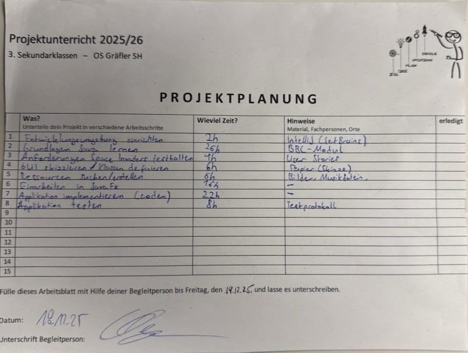
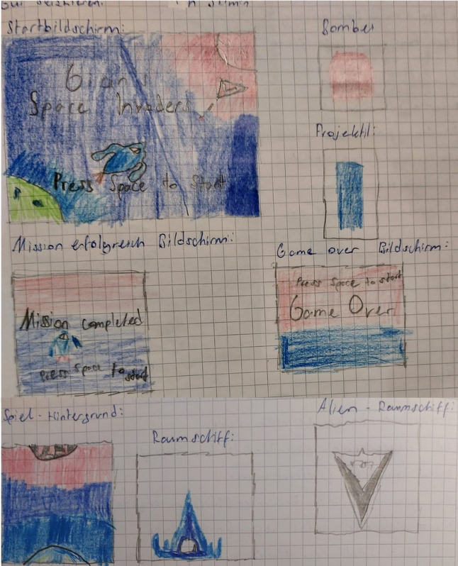
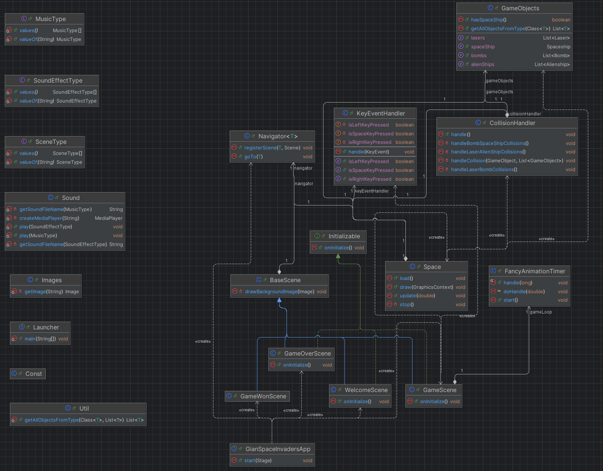

# Gian's Space Invaders
Dieses Spiel wurde im Rahmen eines Schulprojektes in der 3. Sekundarschule im Schulhaus Gräfler, Schaffhausen, Schweiz entwickelt.
Die Idee war es, den Arcade-Game-Klassiker Space Invaders neu in Java zu programmieren.

## Autor
Gian Rohr, gian.rohr@gmx.ch, 3. Sekundarschule Schulhaus Gräfler, Schaffhausen, Schweiz 
## Spezial Features
- Musik und Soundeffekte

## Verwendete Frameworks
- Java SDK 21
- [JavaFX][fx] als Desktop UI-Framework
- Gradle als Build Tool

## Anforderung
800 x 600 resolution

## TODOs
- Mehr Level
- Score für Abschüsse
- Highscore

### Plannung


### User Stories
User Stories Space Invaders
Als Benutzer möchte ich …
1.	einen Start-Bildschirm angezeigt bekommen.
2.	mit der Leertaste das Spiel starten  (Spiel-Bildschirm mit Hintergrundbild)
3.	mein Raumschiff angezeigt werden.
4.	mein Raumschiff mit den Pfeiltasten nach Links und Rechts verschieben können (nur bis zum Rand).
5.	Ufos (2 Reihen à je 7) angezeigt werden.
6.	Ufos sich gleichmässig von Rand zu Rand bewegen (sobald Rand erreicht wird, ändert die Richtung).
7.	Ufos zufällig Bomben abwerfen.
8.	Laser mit der Leertaste abfeuern können (begrenzte Anzahl).
9.	feindliche Bomben und Ufos mit dem Laser abschiessen können.
10.	dass mein Raumschiff explodiert, wenn ich von einer feindlichen Bombe getroffen werde.
11.	verlieren und Spielende-Bildschirm angezeigt bekommen, wenn mein Raumschiff zerstört wurde.
12.	gewinnen und Gewinner-Bildschirm angezeigt bekommen, wenn ich alle Ufos abgeschossen habe.
13.	das Spiel neu starten können, wenn ich im Spielende- oder Gewinner-Bildschirm Leertaste drücke.
14.	  Hintergrundmusik und Soundeffekte hören.


### Mockup


### Achitektur

Der JavaFX UI Code wurde zu grossen Teilen vom Gamecode entkoppelt.


### Installation
Der Code wurde mit Java SDK 21 und Java FX 16 getestet.
```sh
$ git clone https://github.com/EpicAgent/gians-space-invaders.git
$ java -jar \build\libs\gians-space-invaders-1.0-SNAPSHOT-all.jar
```
[//]: #
[fx]: <https://openjfx.io/>